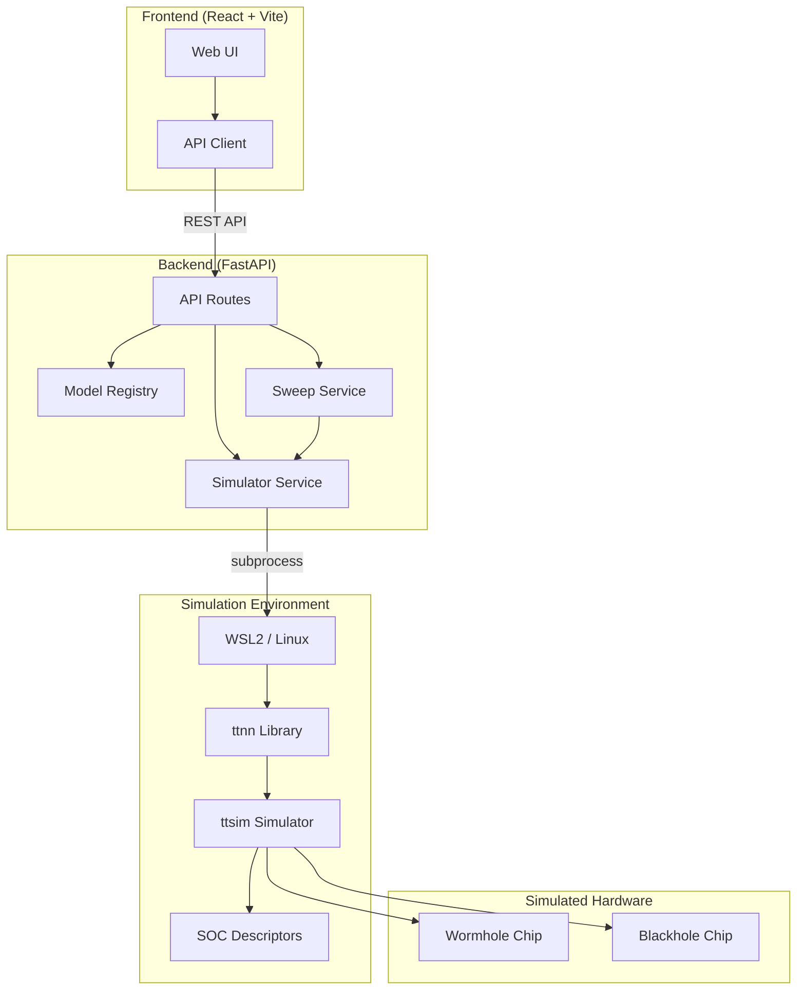
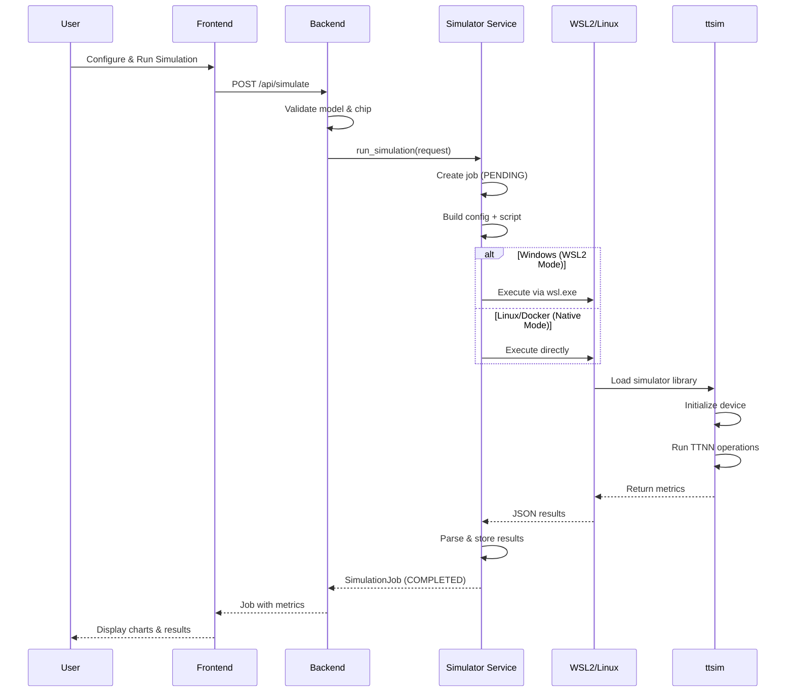
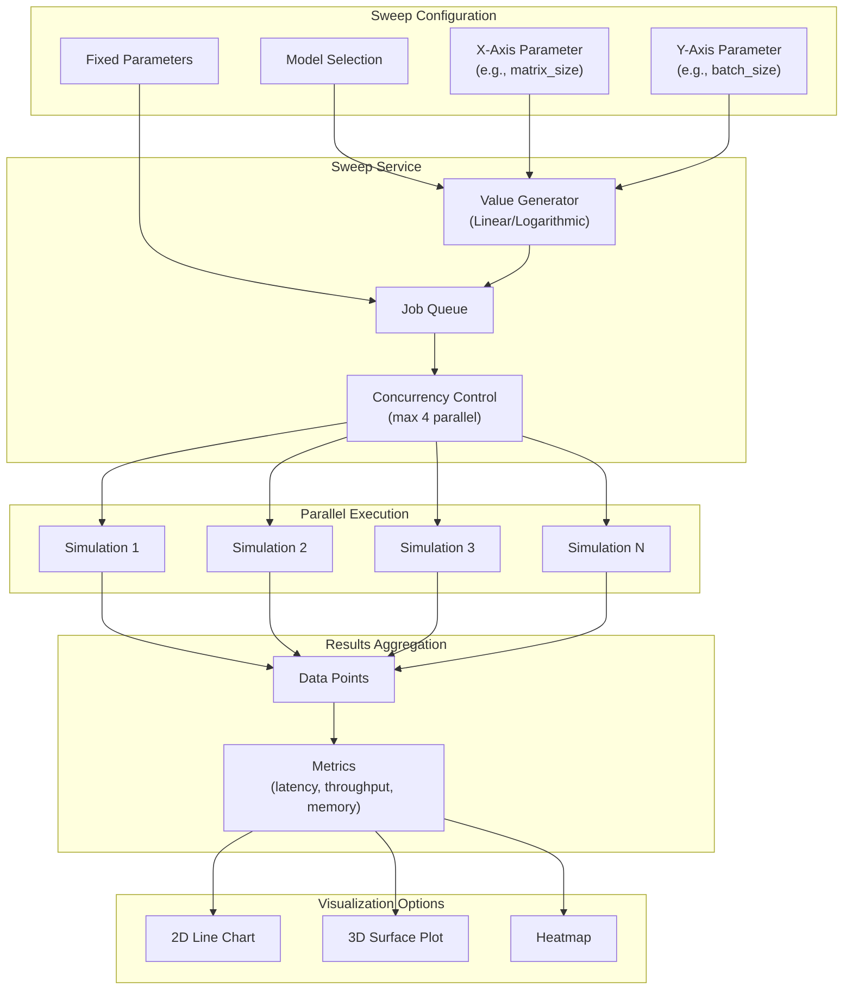
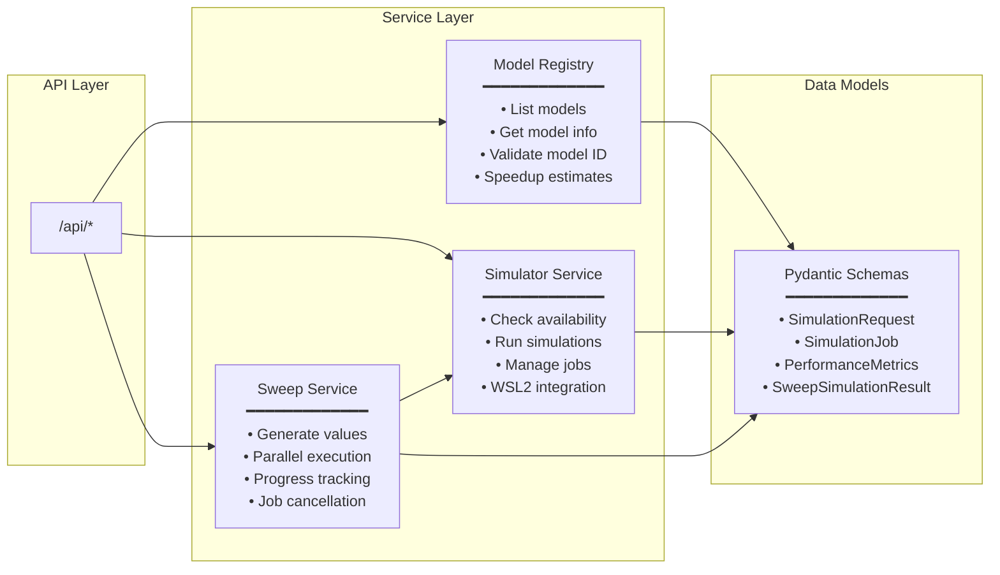

# Tenstorrent Simulator Playground

A web-based playground for exploring Tenstorrent AI accelerator capabilities using a **hardware-free simulator**. Run real TTNN operations, visualize performance metrics, and learn about Tenstorrent's developer tooling—no physical hardware required.


## ✨ Features

- 🚀 **Real Simulation** — Execute actual TTNN operations on the ttsim hardware simulator
- 🔀 **Multi-Architecture** — Switch between Wormhole and Blackhole simulators with a single click
- 📊 **Performance Metrics** — View latency, throughput, and memory usage with interactive charts
- 🔄 **Hardware Comparison** — Compare simulated performance against expected silicon results
- 📈 **Parameter Sweeps** — Run 1D and 2D parameter sweeps with automatic visualization
- 📉 **Multiple Visualizations** — 2D line charts, 3D surface plots, and heatmaps with themed color schemes
- 🎨 **Modern UI** — Dark theme with Tenstorrent brand colors and responsive design
- ⚡ **Multiple Models** — Element-wise operations, activations, and operation chains
- 💾 **Smart Defaults** — Sensible parameter defaults with settings preserved across model changes

---

## 🖼️ Preview

The playground features model selection, parameter sweep configuration, and interactive results:


---

## 🏗️ Architecture

### System Overview

The playground uses a three-tier architecture with the frontend communicating with a FastAPI backend, which orchestrates simulations through the ttsim hardware simulator running in WSL2 (Windows) or natively (Linux/Docker).



### Simulation Flow

When a user runs a simulation, the request flows through multiple layers before executing on the ttsim hardware simulator.



### Parameter Sweep Architecture

Parameter sweeps allow exploring performance across multiple configurations. The sweep service manages concurrent simulations and aggregates results for visualization.



### Backend Services

The backend is organized into three main services that work together to handle simulation requests.



---

## 🚀 Quick Start

Choose your preferred installation method:

| Method                                                  | Best For                     | Time    |
| ------------------------------------------------------- | ---------------------------- | ------- |
| [🐳 Docker](#option-1-docker-recommended)                | Fastest setup, testing       | ~2 min  |
| [⚡ Automated Script](#option-2-automated-setup-windows) | Full development environment | ~10 min |
| [🔧 Manual Setup](#option-3-manual-setup)                | Custom configurations        | ~15 min |

---

### Option 1: Docker (Recommended)

The fastest way to get started. Requires [Docker Desktop](https://www.docker.com/products/docker-desktop/).

```bash
# Clone the repository
git clone https://github.com/tenstorrent/tenstorrent_playground.git
cd tenstorrent_playground

# Start the playground
docker compose up --build
```

**🌐 Open http://localhost:5173** in your browser.

> **Note**: The Docker setup runs the UI and API. Full simulation support requires WSL2 with ttsim configured on the host.

To stop: Press `Ctrl+C` or run `docker compose down`

---

### Option 2: Automated Setup (Windows)

One-command setup for Windows with WSL2.

**Prerequisites:**
- Windows 10/11 with [WSL2](https://docs.microsoft.com/en-us/windows/wsl/install) (Ubuntu)
- [Node.js 20+](https://nodejs.org/)
- [Git](https://git-scm.com/)

```powershell
# Clone the repository
git clone https://github.com/tenstorrent/tenstorrent_playground.git
cd tenstorrent_playground

# Run the setup script (installs everything in WSL2 and Windows)
.\scripts\setup.ps1

# Start the development servers
.\scripts\dev.ps1
```

**🌐 Open http://localhost:5173** in your browser.

---

### Option 3: Manual Setup

For custom configurations or non-Windows platforms.

#### Step 1: WSL2 Environment Setup

Run these commands in WSL2 Ubuntu:

```bash
# Install system packages
sudo apt update && sudo apt install -y python3 python3-pip wget curl git

# Install ttnn and PyTorch
pip3 install ttnn torch --break-system-packages --index-url https://download.pytorch.org/whl/cpu

# Download ttsim simulators (Wormhole and Blackhole)
mkdir -p ~/ttsim && cd ~/ttsim
wget https://github.com/tenstorrent/ttsim/releases/download/v1.3.1/libttsim_wh.so
wget https://github.com/tenstorrent/ttsim/releases/download/v1.3.1/libttsim_bh.so

# Clone tt-metal for SOC descriptors
git clone --depth 1 https://github.com/tenstorrent/tt-metal.git ~/tt-metal

# Copy SOC descriptors for both architectures
cp ~/tt-metal/tt_metal/soc_descriptors/wormhole_b0_80_arch.yaml ~/ttsim/soc_descriptor.yaml
cp ~/tt-metal/tt_metal/soc_descriptors/wormhole_b0_80_arch.yaml ~/ttsim/wormhole_soc_descriptor.yaml
cp ~/tt-metal/tt_metal/soc_descriptors/blackhole_140_arch.yaml ~/ttsim/blackhole_soc_descriptor.yaml

# Install SFPI firmware
wget https://github.com/tenstorrent/sfpi/releases/download/7.17.0/sfpi_7.17.0_x86_64_debian.deb
sudo dpkg -i sfpi_7.17.0_x86_64_debian.deb

# Add environment variables to ~/.bashrc
cat >> ~/.bashrc << 'EOF'

# Tenstorrent Playground Environment
export TT_METAL_HOME=~/tt-metal
export TT_METAL_SIMULATOR=~/ttsim/libttsim_wh.so
export TT_METAL_SLOW_DISPATCH_MODE=1
EOF
source ~/.bashrc

# Verify installation
python3 -c "import ttnn; d=ttnn.open_device(0); print('✓ Simulator working'); ttnn.close_device(d)"
```

#### Step 2: Clone & Install Dependencies

```bash
# Clone repository
git clone https://github.com/tenstorrent/tenstorrent_playground.git
cd tenstorrent_playground

# Backend setup (requires uv - https://github.com/astral-sh/uv)
cd backend
uv sync
cd ..

# Frontend setup
cd frontend
npm install
cd ..
```

#### Step 3: Start Development Servers

**Terminal 1 — Backend:**
```bash
cd backend
uv run uvicorn playground.main:app --reload --host 127.0.0.1 --port 8000
```

**Terminal 2 — Frontend:**
```bash
cd frontend
npm run dev
```

**🌐 Open http://localhost:5173** in your browser.

---

## 📁 Project Structure

```
tenstorrent_playground/
├── backend/                    # FastAPI backend
│   ├── src/playground/
│   │   ├── api/routes.py       # REST API endpoints
│   │   ├── services/
│   │   │   ├── simulator.py    # WSL2/ttsim integration
│   │   │   ├── model_registry.py
│   │   │   └── sweep_service.py
│   │   ├── models/schemas.py   # Pydantic schemas
│   │   └── config.py           # Configuration
│   ├── pyproject.toml
│   ├── Dockerfile
│   └── README.md
├── frontend/                   # React + Vite frontend
│   ├── src/
│   │   ├── components/         # UI components
│   │   ├── api/                # TypeScript API client
│   │   └── App.tsx
│   ├── package.json
│   ├── Dockerfile
│   └── README.md
├── scripts/
│   ├── setup.ps1               # Windows automated setup
│   ├── setup.sh                # Linux/WSL setup
│   ├── dev.ps1                 # Start dev servers (Windows)
│   └── dev.sh                  # Start dev servers (Linux)
├── docker-compose.yml          # Docker configuration
├── .env.example                # Environment template
└── README.md                   # This file
```

---

## 🔌 API Reference

Base URL: `http://localhost:8000`

### Endpoints

| Endpoint                     | Method | Description                       |
| ---------------------------- | ------ | --------------------------------- |
| `/api/health`                | GET    | Health check and simulator status |
| `/api/models`                | GET    | List available models             |
| `/api/models/{id}`           | GET    | Get model details                 |
| `/api/simulate`              | POST   | Run a single simulation           |
| `/api/simulate/{job_id}`     | GET    | Get simulation status/results     |
| `/api/jobs`                  | GET    | List recent simulation jobs       |
| `/api/sweep`                 | POST   | Start a parameter sweep           |
| `/api/sweep/{job_id}`        | GET    | Get sweep status/results          |
| `/api/sweep/{job_id}/cancel` | POST   | Cancel a running sweep            |

### Example: Run a Simulation

```bash
curl -X POST http://localhost:8000/api/simulate \
  -H "Content-Type: application/json" \
  -d '{
    "model_id": "matmul_benchmark",
    "iterations": 10,
    "parameters": {"matrix_size": 512}
  }'
```

### Interactive Documentation

When the backend is running, visit:
- **Swagger UI**: http://localhost:8000/docs
- **ReDoc**: http://localhost:8000/redoc

---

## 🎛️ Available Models

| Model ID             | Category   | Description                         | Parameters                  |
| -------------------- | ---------- | ----------------------------------- | --------------------------- |
| `add_benchmark`      | Arithmetic | Element-wise addition (A + B)       | `matrix_size`, `batch_size` |
| `subtract_benchmark` | Arithmetic | Element-wise subtraction (A - B)    | `matrix_size`, `batch_size` |
| `multiply_benchmark` | Arithmetic | Element-wise multiplication (A * B) | `matrix_size`, `batch_size` |
| `exp_benchmark`      | Math       | Exponential function (e^x)          | `matrix_size`, `batch_size` |
| `log_benchmark`      | Math       | Natural logarithm (ln)              | `matrix_size`, `batch_size` |
| `sqrt_benchmark`     | Math       | Square root                         | `matrix_size`, `batch_size` |
| `relu_benchmark`     | Activation | ReLU: max(0, x)                     | `matrix_size`, `batch_size` |
| `sigmoid_benchmark`  | Activation | Sigmoid: 1/(1+exp(-x))              | `matrix_size`, `batch_size` |
| `tanh_benchmark`     | Activation | Hyperbolic tangent                  | `matrix_size`, `batch_size` |
| `gelu_benchmark`     | Activation | Gaussian Error Linear Unit          | `matrix_size`, `batch_size` |
| `chain_benchmark`    | Pipeline   | Chain: Add → ReLU → Mul             | `matrix_size`, `batch_size` |
| `chain_gelu_mul`     | Pipeline   | Chain: GELU → Mul (Transformer FFN) | `matrix_size`, `batch_size` |

---

## ⚙️ Configuration

### Environment Variables

Copy `.env.example` to `.env` and customize as needed:

```bash
cp .env.example .env
```

| Variable                | Default                     | Description                       |
| ----------------------- | --------------------------- | --------------------------------- |
| `DEBUG`                 | `false`                     | Enable debug logging              |
| `HOST`                  | `0.0.0.0`                   | API server bind address           |
| `PORT`                  | `8000`                      | API server port                   |
| `WSL_DISTRO`            | `Ubuntu`                    | WSL2 distribution name            |
| `TT_METAL_HOME`         | `~/tt-metal`                | tt-metal installation path        |
| `TT_METAL_SIMULATOR_WH` | `~/ttsim/libttsim_wh.so`    | Wormhole simulator library path   |
| `TT_METAL_SIMULATOR_BH` | `~/ttsim/libttsim_bh.so`    | Blackhole simulator library path  |
| `SIMULATOR_TIMEOUT`     | `300`                       | Simulation timeout (seconds)      |
| `CORS_ORIGINS`          | `["http://localhost:5173"]` | Allowed CORS origins (JSON array) |

---

## 🛠️ Development

### Running Tests

```bash
# Backend tests
cd backend
uv run pytest

# Frontend tests
cd frontend
npm run test
```

### Code Formatting

```bash
# Backend
cd backend
uv run ruff format .
uv run ruff check --fix .

# Frontend
cd frontend
npm run lint
```

### Building for Production

```bash
# Frontend
cd frontend
npm run build
# Output in dist/

# Backend runs directly with uvicorn
```

---

## 🐛 Troubleshooting

### Simulator not available

**Symptoms**: Health check shows `simulator_available: false` or a specific chip shows as unavailable

**Solution**: Ensure WSL2 environment variables are set and both simulator files exist:
```bash
# Check simulator files exist
ls -la ~/ttsim/*.so

# Set environment variables
export TT_METAL_HOME=~/tt-metal
export TT_METAL_SIMULATOR=~/ttsim/libttsim_wh.so
export TT_METAL_SLOW_DISPATCH_MODE=1
```

### Blackhole simulator returning zeros

**Symptoms**: Blackhole simulations complete but show 0 latency/throughput

**Solution**: Ensure the correct SOC descriptor is available:
```bash
# Copy Blackhole SOC descriptor
cp ~/tt-metal/tt_metal/soc_descriptors/blackhole_140_arch.yaml ~/ttsim/blackhole_soc_descriptor.yaml
```

### SFPI firmware not found

**Symptoms**: Simulation fails with SFPI-related error

**Solution**: Install SFPI firmware:
```bash
wget https://github.com/tenstorrent/sfpi/releases/download/7.17.0/sfpi_7.17.0_x86_64_debian.deb
sudo dpkg -i sfpi_7.17.0_x86_64_debian.deb
```

### Backend can't connect to WSL

**Symptoms**: Simulations hang or fail

**Solution**: Check WSL distro name matches your system:
```powershell
wsl -l -q  # List available distros
```
Update `WSL_DISTRO` in `.env` if needed.

### Port already in use

**Symptoms**: "Address already in use" error

**Solution**:
```powershell
# Find and kill process on port 8000
netstat -ano | findstr :8000
taskkill /PID <PID> /F
```

### Docker build fails

**Symptoms**: TypeScript or Python errors during build

**Solution**: Clean rebuild:
```bash
docker compose down
docker compose build --no-cache
docker compose up
```

---

## 🤝 Contributing

We welcome contributions! Please follow these steps:

1. Fork the repository
2. Create a feature branch: `git checkout -b feat/my-feature`
3. Make your changes with clear commit messages
4. Run tests and linting
5. Submit a pull request

### Commit Convention

Use [Conventional Commits](https://www.conventionalcommits.org/):
- `feat:` New features
- `fix:` Bug fixes
- `docs:` Documentation changes
- `refactor:` Code refactoring
- `test:` Test additions/changes
- `chore:` Maintenance tasks

---

## 📚 Technology Stack

| Layer         | Technologies                                                      |
| ------------- | ----------------------------------------------------------------- |
| **Frontend**  | React 19, TypeScript, Vite 7, Tailwind CSS 4, Chart.js, Plotly.js |
| **Backend**   | Python 3.12+, FastAPI, Pydantic, uvicorn                          |
| **Simulator** | ttsim 1.3.1, ttnn, PyTorch (CPU)                                  |
| **Platform**  | Windows + WSL2 Ubuntu, Docker                                     |
| **Tools**     | uv, npm, Docker Compose                                           |

---

## 📄 License

This project is licensed under the MIT License. See [LICENSE](LICENSE) for details.

---

## 🙏 Acknowledgments

- [Tenstorrent](https://tenstorrent.com/) for tt-metal and the ttsim simulator
- [ttsim](https://github.com/tenstorrent/ttsim) hardware simulator project
- The open-source community for the amazing tools and frameworks

---

<p align="center">
  <strong>Built with ❤️ for the Tenstorrent developer community</strong>
</p>
