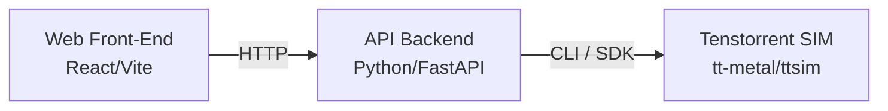

# Tenstorrent Simulator Web Playground – End-to-End Project Guide

## Goal
Build a **local, web-based playground** that demonstrates Tenstorrent developer tooling using a **hardware-free simulator**.  
The demo allows a user to:
- Select from **predefined, pre-trained models**
- Run simulations on Tenstorrent’s simulator
- View **simulated performance metrics**
- Compare against **expected real-hardware performance**
- Interact through a **modern, polished web UI**

This document is structured so it can be fed directly into a **coding agent**.

---

## High-Level Architecture



---

## Phase 0 – Scope Constraints

- Target completion time: **1 day**
- Simulator only (no physical hardware)
- Predefined models only
- Inference-only
- Performance focus: latency, throughput
- Single-machine local deployment

---

## Phase 1 – Windows + WSL2 Setup

```powershell
wsl --install
```

Reboot, then install **Ubuntu 22.04**.

Verify:
```bash
uname -a
```

---

## Phase 2 – Linux Dependencies

```bash
sudo apt update && sudo apt upgrade -y
sudo apt install -y   build-essential   cmake   git   clang   ninja-build   curl   python3
```

---

## Phase 3 – Install uv (Python Tooling)

### Install
```bash
curl -LsSf https://astral.sh/uv/install.sh | sh
source ~/.bashrc
```

Verify:
```bash
uv --version
```

---

## Phase 4 – Clone Tenstorrent Simulator

```bash
git clone https://github.com/tenstorrent/tt-metal.git
cd tt-metal
./install_dependencies.sh
mkdir build && cd build
cmake ..
make -j$(nproc)
```

---

## Phase 5 – Model Strategy

Use **pre-trained small models** with multiple architectural variants.

Examples:
- LeNet CNN (2–4 conv layers)
- Tiny Transformer (2–4 layers)
- MLP classifier

Sources:
- Hugging Face
- PyTorch Hub

---

## Phase 6 – Backend (Python + uv)

```bash
mkdir backend
cd backend
uv init
uv python install 3.12
uv python pin 3.12
uv add fastapi uvicorn
```

Run server:
```bash
uv run uvicorn main:app --reload
```

---

## Phase 7 – API Responsibilities

- Accept model selection
- Accept parameter ranges
- Invoke simulator
- Parse metrics
- Return JSON

Example:
```json
{
  "model": "lenet_small",
  "batch_size": 32,
  "simulated_latency_ms": 4.8,
  "expected_hw_latency_ms": 0.9
}
```

---

## Phase 8 – Frontend

Stack:
- React + Vite
- Tailwind
- Chart.js / Recharts

Flow:
1. Select model
2. Configure parameters
3. Click Run
4. View charts

---

## Phase 9 – Demo

Show:
- No-hardware development
- Simulator-backed insights
- Clean UX

---

## Success Criteria

- Fast setup
- Polished UI
- Interview-ready
